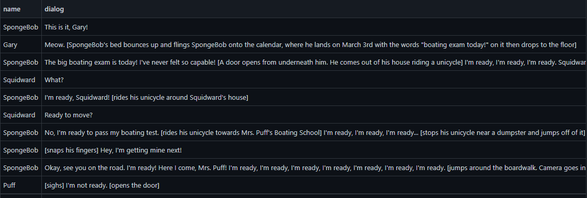

# SpongeBob-AI-Chatbot
## Obtaining data- dialog_parse.ipynb
I wanted to create an AI chatbot that would talk like Spongebob to familiarize myself with machine learning and artificial intelligence concepts and utilize Python's abilities with these two subjects. To start, I went to Wiki Transcripts (https://ideas.fandom.com/wiki/Category:Transcripts) and downloaded transcripts of 14 of my childhood favorite Spongebob episodes into a text file **spongebob dialog.txt**. 

Next, I would parse this text file using **regular expressions** and used **Pandas**, a Python package used for data analysis and associated manipulation of tabular data in data frames, to separate the names of the characters and their actual dialog in the text file. I was then left with a table that had the name of the character on the left side, and their associated dialog on the right side. Finally, this data frame was converted into a csv file that the model would base its training from (see **Spongebob.csv**)

## Training the model
After I uploaded my data frame csv file to Kaggle, an online community of data scientists and machine learning practitioners, I would adjust a model derived from the one explained here: https://towardsdatascience.com/make-your-own-rick-sanchez-bot-with-transformers-and-dialogpt-fine-tuning-f85e6d1f4e30. The model utiilized **Pytorch's Transformers library** and **Microsft's dialoGPT** for **natural language processing**. I set the number of training epochs to 6 (# of times the model will cycle through the training set), in order to minimize my perplexity (a measurement of how well a probability distribution or probability model predicts a sample). My perplexity number was 5.28, which is relativley good considering my data set. See below for model training statistics.

